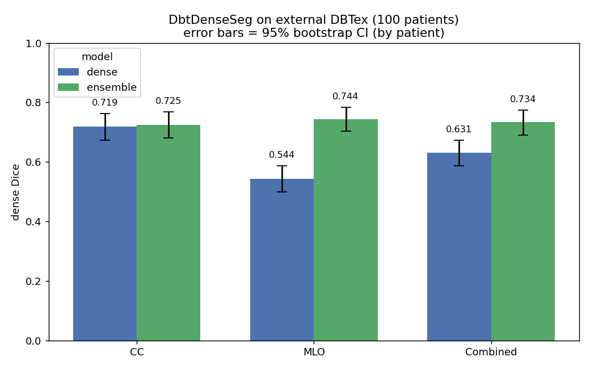

# DbtDenseSeg — models, training & performance

Three segmentation models combined into one ensemble for dense breast-tissue
segmentation on Digital Breast Tomosynthesis (DBT):

```
ensemble = dense ∩ area ∩ ¬muscle
```
i.e. dense-tissue predictions, constrained to the breast area and with pectoral
muscle removed.

## Architectures, inputs, and training data

| Model | Arch | Dim | Input it sees | Training data |
|---|---|---|---|---|
| **Area** | SegFormer-B2 (HF `nvidia/segformer-b2-finetuned-ade-512-512`) | **2D** | one reconstructed DBT slice, resized to 512×512, raw 1-ch | DBT slices (multi-label patients) **+ 2096 FFDM** images with area/density labels; **both views** |
| **Muscle** | SegFormer-B2 | **2D** | one DBT slice, 512×512, raw 1-ch | DBT **MLO/ML** slices, 233 train series (17 with paired area annotation); CC excluded (no muscle) |
| **Dense** | SwinUNETR (MONAI, feature_size=48, random init) | **3D** | the **whole** reconstructed DBT volume (Z×H×W) | full DBT volumes, **698 train / 111 val** series (~199 Hologic patients) |

### 2D vs 3D — what each ingests
- **2D models (area, muscle):** operate **slice-by-slice**. Each reconstructed slice is resized to **512×512**, kept as raw 1-channel intensity (0–1023), repeated to 3 channels and **ImageNet-normalized** (to match the pretrained SegFormer stem). Per-slice predictions are stacked across Z (2.5D) with light Z-Gaussian smoothing.
- **3D model (dense):** operates on the **entire volume**, intensity-normalized to [0,1] (÷1023), with **sliding-window** inference at ROI **32×256×256** and Gaussian blending.

## Loss functions

- **Area** — BCE + Dice + **muscle-aware** penalty (λ=0.3):
  `L = BCE + Dice + 0.3 · mean(p · muscle_prior · (1 − area_gt))`
  (discourages the area mask from extending into pectoral muscle).
- **Muscle** — BCE + Dice + **area-aware** penalty (λ=0.7):
  `L = BCE + Dice + 0.7 · mean(p · area_prior · (1 − muscle_gt))`
  (discourages muscle predictions inside breast tissue; drove false-positive
  "area bleed" to ~0).
- **Dense** — `gdl_ce`: **Generalized Dice Loss + 0.5 · BCE**
  (GDL uses class-size reweighting `w_c = 1/(V_c+1)²`, Sudre 2017).

## Training recipe
- 2D: AdamW **lr=5e-4**, weight decay 1e-5, cosine decay, **grad-clip 1.0**, AMP fp16, ~60 epochs, batch 16, 512×512. (ImageNet norm + grad-clip were required for stability.)
- 3D: AdamW **lr=2e-4**, grad-clip 0.5, AMP fp16 + gradient checkpointing, ROI 32×256×256, ~60 epochs.

## Internal validation (held-out)
| Model | Metric | Value |
|---|---|---|
| Area | val Dice | **0.9772** (precision 0.973, recall 0.983) |
| Muscle | val Dice | **0.9580** (area-bleed ≈ 0.0001) |
| Dense | val Dice | **0.7381** |

## External performance — DBTex (100 patients, 400 series)

Dense Dice vs ground-truth dense masks on the external DBTex set, by view:



| View | dense model | **ensemble** |
|---|---|---|
| CC | 0.719 | **0.725** |
| MLO | 0.544 | **0.744** |
| Combined | 0.631 | **0.734** |

Error bars in the figure are **95% bootstrap CIs, clustered by patient** (each
patient contributes up to 4 views). Reproduce with
`python assets/plot_performance.py` (reads `assets/dbtex_results.csv`).

**Takeaway:** on **CC** (no pectoral muscle) the dense model and the ensemble are
comparable. On **MLO** the raw dense model drops to 0.544 because of
pectoral-muscle false positives; the ensemble's **muscle subtraction + area
constraint** recovers it to **0.744** — the main reason to use the ensemble.
